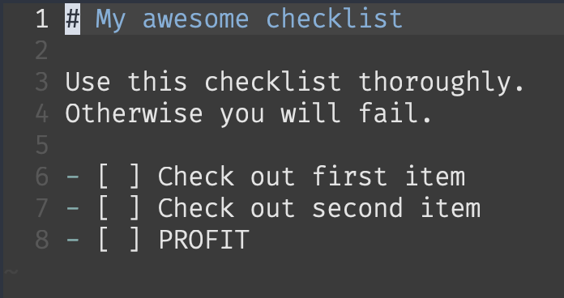
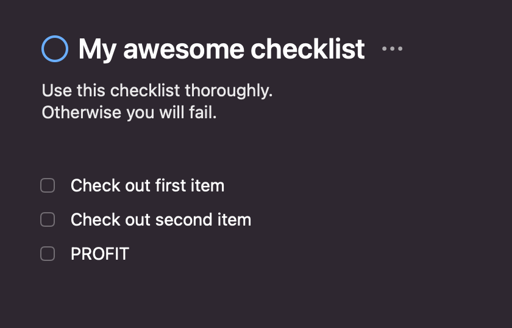

# things-url-generator

A tool to generate a new Things projects deeplink URL from Markdown checklists.

| :-------------: |:-------------:| :------:|
|      | 💫 |  |

 ```bash
 cat checklist.md | things-url-generator | xargs open 
 ```

